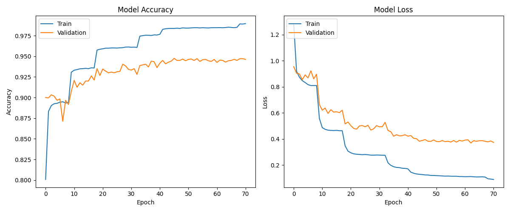

# AquaSentry 🌊🛡️

**Status:** 🚧 In Active Development 🚧

**AquaSentry** is an AI-powered acoustic surveillance system for **Underwater Domain Awareness (UDA)**.  
It processes hydrophone audio data to **detect, analyze, and classify acoustic anomalies** such as vessels, marine life, or unknown underwater activities.

---

## 📂 Project Structure

```
AquaSentry/
│
├── Utils/
│   ├── audioCollector.py      # Downloads/collects audio data
│   ├── audioExtractor.py      # Extracts relevant segments from raw audio
│   ├── audioProcessor.py      # Applies preprocessing, denoising
│   ├── audioSplit.py          # Splits audio into training/validation/test 
│   ├── fileOrganizer.py       # Organizes datasets and processed files
│   └── mainTrainer.py         # Trains the ML model
│
├── api.py                     # API interface for inference
├── app.py                     # Streamlit web interface
├── requirements.txt           # Project dependencies
├── .gitignore                 # Ignored files/folders
├── .env                       # Environment variables (API keys, secrets)
└── README.md                  # Project documentation
```

---

## 🎯 Key Features

- **Audio Collection & Preprocessing**
  - Automated download, extraction, and noise profiling.
  - Augmentation (Gaussian noise, pitch shift, time stretch) to improve model robustness.
  
- **Anomaly Detection**
  - Identifies unusual acoustic patterns against an ambient noise baseline.

- **Feature Extraction**
  - Extracts MFCCs, spectral contrast, chroma features using `librosa`.

- **Classification**
  - Uses TensorFlow/Keras models to classify anomalies into predefined categories.

- **Web & API Integration**
  - Streamlit interface for visualization and real-time inference.
  - REST API for external integration.

---

## 🛠️ Tech Stack

| Domain                  | Tools & Libraries |
|------------------------|-------------------|
| **Frontend**           | Streamlit, Altair |
| **Backend / API**      | Flask/FastAPI (planned), google-generativeai |
| **Audio Processing**   | librosa, pydub, audiomentations |
| **Machine Learning**   | TensorFlow, scikit-learn, imbalanced-learn |
| **Data Handling**      | pandas, numpy |
| **Visualization**      | matplotlib, seaborn |
| **Web Scraping**       | requests, BeautifulSoup4 |

---

## 🚀 Getting Started

### 1️⃣ Clone the Repository
```bash
git clone https://github.com/YJuDeAd/AquaSentry
cd AquaSentry
```

### 2️⃣ Install Dependencies
```bash
pip install -r requirements.txt
```

### 3️⃣ Configure Environment Variables
Create a `.env` file in the root directory:
```ini
API_KEY=your_google_generative_ai_key
```

### 4️⃣ Run the Streamlit App
```bash
streamlit run app.py
```

---

## 📊 Project Pipeline

1. **Collect & Organize Data** (`Utils/audioCollector.py`, `Utils/fileOrganizer.py`)
2. **Preprocess & Augment Audio** (`Utils/audioProcessor.py`)
3. **Split Dataset** (`Utils/audioSplit.py`)
4. **Train Model** (`Utils/mainTrainer.py`)
5. **Deploy & Monitor** (`app.py`, `api.py`)

---

## 📈 Training Performance

The model's performance over epochs is shown below:



---

## 📅 Development Roadmap

- [ ] Improve anomaly detection algorithm  
- [ ] Integrate advanced feature extraction methods  
- [ ] Deploy API endpoint for classification  
- [ ] Implement model explainability tools  
- [ ] Optimize for real-time inference  

---

## 👥 Contributors

- [Punya Arora](https://github.com/YJuDeAd)
- [Prasun Jha](https://github.com/PrasunJha15)
- [Rajmangalam Gupta](https://github.com/RajmangalmGupta)
- [Vaibhav Rustagi](https://github.com/getit-pajji)

---